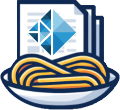
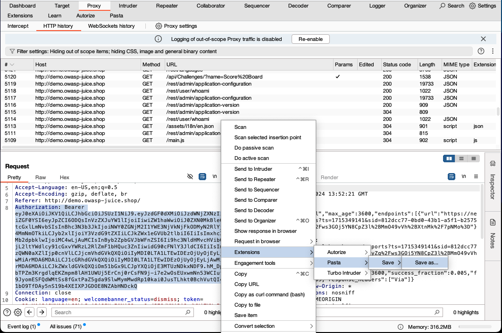
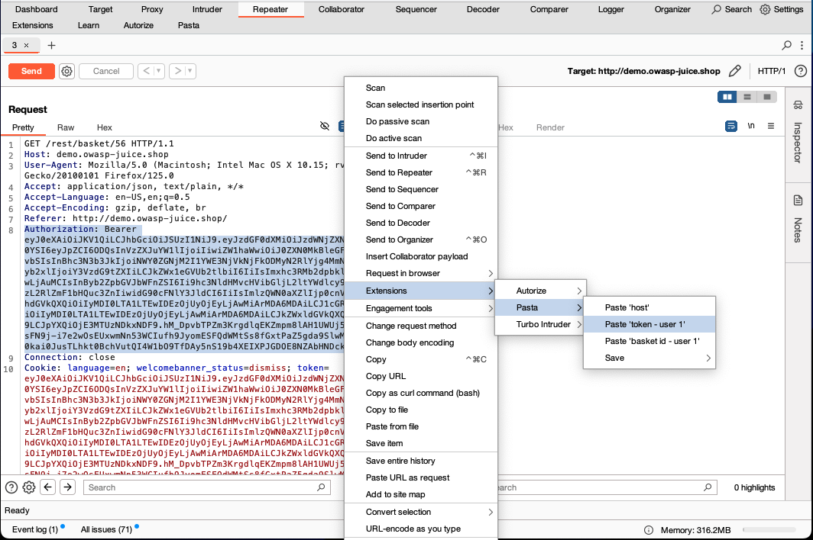
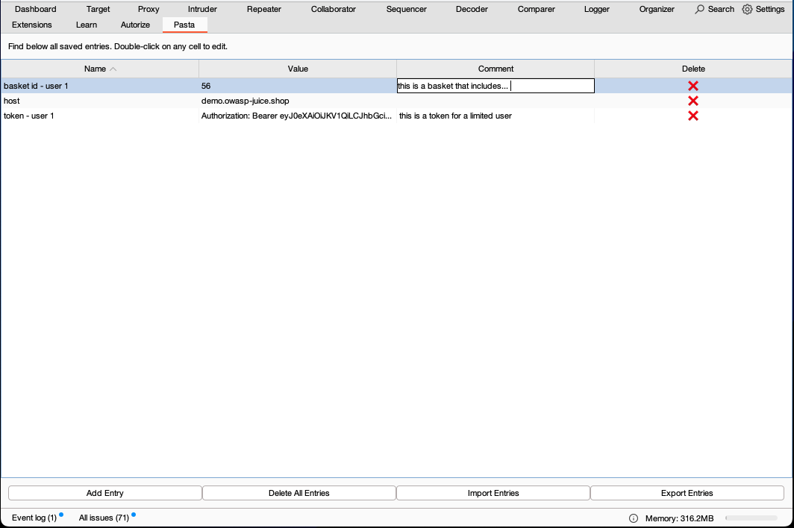
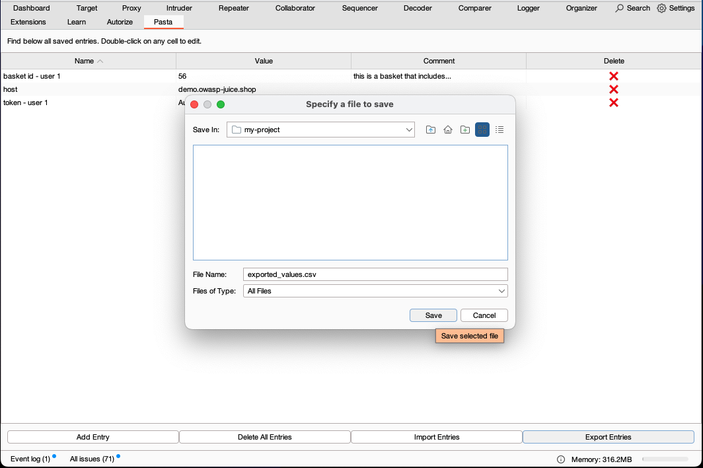

<h1 align="center">
  
    
  
  
    Burp Pasta
  
</h1>

    A Burp Suite extension that allows you to save, paste and organize values during your web security testing assessments. 

---

With Burp Pasta you can easily save values from requests and responses, and quickly paste them whenever needed.

## Features

- Save values from requests and responses
- Organize saved values in a table for easy access
- Quickly paste saved values into requests or other fields
- Export and import saved values for backup or sharing with team members

## Installation

You can install burp-pasta by manually installing a release. burp-pasta is coming soon to the official BApp Store.

### Manual Install

1. Download the burp-pasta JAR file from the [Releases](https://github.com/RefactorSecurity/burp-pasta/releases) page
2. Open Burp Suite
3. Go to the "Extender" tab
4. Click on the "Add" button
5. Select the burp-pasta JAR file
6. The extension will be loaded into Burp Suite

## Usage

1. Save Values:
   - Navigate to the request or response tab in Burp Suite
   - Select the value you want to save
   - Right-click and choose "Extensions" -> "Pasta" -> "Save" -> "Save as..." from the context menu
   - Enter a name to save the value
2. Paste Values:
   - Navigate to the field where you want to paste the value
   - Right-click and choose "Extensions" -> "Pasta" from the context menu
   - Select the value you want to paste from the list
3. Export and Import Values:
   - Go to the "Pasta" tab.
   - Click on the "Export Entries" button to export saved values to a CSV file
   - Click on the "Import Entries" button to import saved values from a CSV file

## Screenshots

***Save values***

***Paste values***

***Organize values in table***

***Export and import values***

## Contributing

If you encounter any issues or have suggestions for improvements, please feel free to open an issue or submit a pull request.

## License

This project is licensed under the [MIT License](LICENSE.md).
